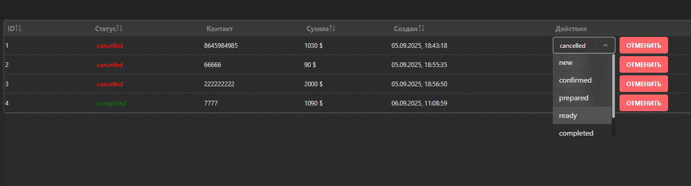
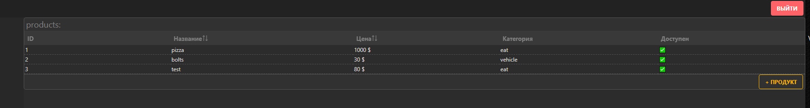

# Order Management System

🚀 Fullstack приложение для управления заказами.  
Сделано как тестовое задание, но построено по принципам **production-ready**: авторизация, роли, заказы, товары, живые обновления через WebSocket.

---

## ✨ Возможности

### 👤 Клиент
- Регистрация / авторизация по email + пароль (JWT в HttpOnly cookie).
- Создание заказа с выбором товаров из каталога.
- Просмотр списка своих заказов.
- Отмена заказа (если он ещё не завершён).
- Получение уведомлений об изменениях заказа в реальном времени.

### 🛠 Админ
- Просмотр всех заказов.
- Смена статусов заказов (`new → confirmed → prepared → ready → completed / cancelled`).
- CRUD для товаров (каталог продуктов).
- Уведомления в реальном времени о новых заказах и изменениях.

## 📊 Мониторинг и логи
- Prometheus: собирает метрики из backend
- Метрики доступны на /metrics.
- Grafana (опционально): можно подключить для красивых дашбордов.
- Логирование запросов и ошибок через winston (с разделением по уровням: info, error).


## 📦 Cтруктура проекта
* backend/     # Node.js + Express + Prisma
* frontend/    # React + Vite + MistUI

## 🛠 Технологии

- **Frontend**: React 18, Vite, MistUI Kit, TanStack Query, Socket.io-client.
- **Backend**: Node.js, Express, Prisma ORM, Socket.io.
- **Database**: SQLite (портативная, работает из коробки).
- **Auth**: JWT + HttpOnly cookies.
- **Other**: TailwindCSS.

---

## ⚡ Запуск локально
### 1. Клонировать репозиторий
```bash
git clone https://github.com/stalk94/order-management
cd order-management
cd backend
npm install
cd ../frontend
npm install

## Тестовые аккаунты
test12 - 123456 (admin)
test11 - 123456
```

## 📸 Скриншоты

Заказы (admin):

Products (admin):

Products add modal (admin):

add order:

<video src="./assets/video.mp4" controls width="600"></video>